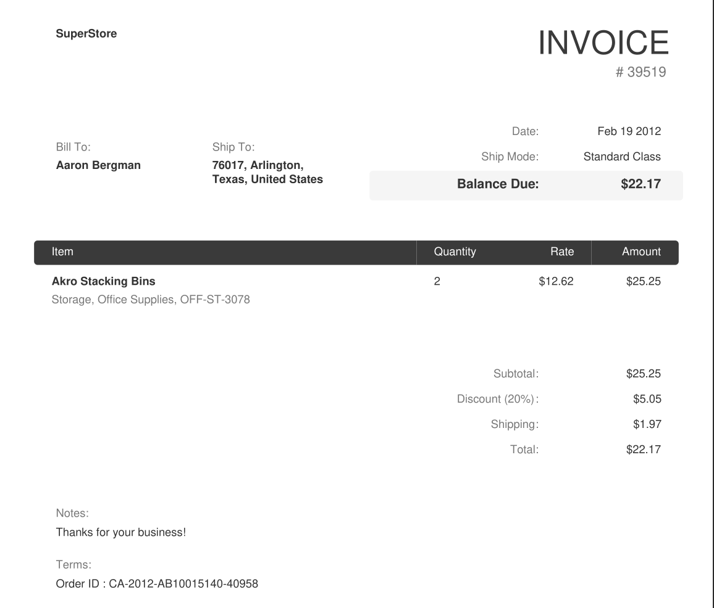
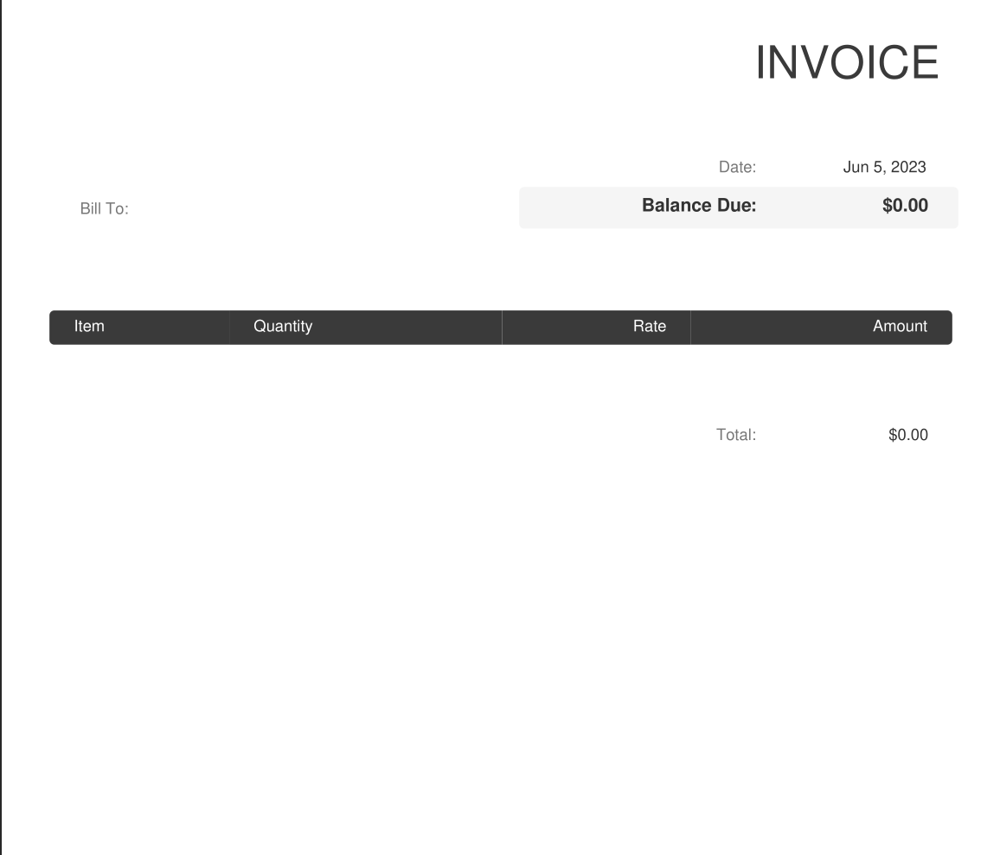
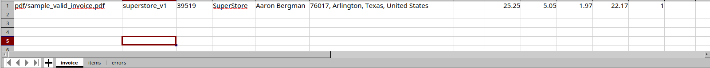
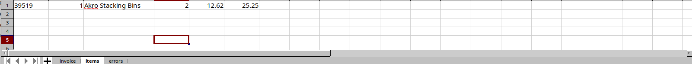
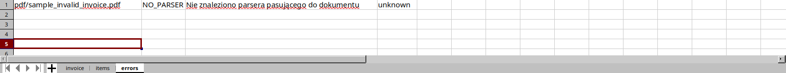

# 📄 Invoice PDF Parser (ETL Pipeline)

A Python project that extracts structured data from PDF invoices and exports it to Excel.

The system is designed as a modular ETL pipeline that handles semi-structured data, validates results, and separates successful and failed processing.

---

## 🚀 Features

- PDF text extraction using PyMuPDF
- Modular parser system (registry-based selection)
- Validation of invoice data (e.g. total consistency checks)
- Export to Excel (invoices, items, errors)
- Automatic file handling:
g  - processed → `archive/`
  - failed → `failed/`
- Unit and pipeline testing using `pytest` and `monkeypatch`

---

## ⚙️ How It Works

1. PDF files are placed in the `pdf/` directory  
2. Text is extracted from each document  
3. The correct parser is selected dynamically  
4. Invoice data is parsed into structured objects  
5. Validation checks are applied (e.g. `TOTAL_MISMATCH`)  
6. Results are exported to `out/invoices.xlsx`  
7. Files are moved:
   - valid → `archive/`
   - invalid → `failed/`

---

## 📊 Example

### Input invoice (PDF)


### Failed invoice (PDF)


### Parsed invoice data (Excel - invoice sheet)


### Extracted items (Excel - items sheet)


### Error handling (Excel - errors sheet)


---

## 📦 Installation

```bash
# 1. Clone repository
git clone https://github.com/adrians00003-byte/Conv_pdf_ex.git
cd Conv_pdf_ex

# 2. Create virtual environment
python -m venv venv

# Activate environment:
# Linux / Mac:
source venv/bin/activate

# Windows:
venv\Scripts\activate

# 3. Install dependencies
pip install -r requirements.txt
```
---

## ▶️ Usage
```bash
python -m main_files.main
```
 ## 📂 Input

Place PDF invoices into:
- pdf/
- 📊 Output
- out/invoices.xlsx → parsed data
- archive/ → successfully processed files
- failed/ → files with errors

---

## 🧪 Testing
``` bash
pip install -r requirements-dev.txt
pytest
```
---

## 📁 Project Structure

- extract/        - PDF text extraction
- parser/         - invoice parsers + registry
- main_files/     - pipeline, models, validators, CLI
- excel/          - Excel export logic
- tests/          - unit and pipeline tests
- docs/           - screenshots
- pdf/            - sample input files
- archive/        - processed files
- failed/         - failed files
- out/            - generated output

---

## ⚠️ Current Limitations

- The current parser is designed for a specific invoice layout (Superstore-style)
- Additional invoice formats require implementing new parsers

---

## 🧠 What This Project Demonstrates

- Working with semi-structured data (PDF → structured output)
- Designing an ETL pipeline
- Data validation and error handling
- Modular architecture (plug-in parsers)
- Debugging real-world data inconsistencies
- Writing testable code with controlled inputs

---

## 📌 Future Improvements (optional)

- Support for multiple invoice layouts
- More advanced item parsing (multi-line / multiple items)
- Simple UI (CLI improvements or web interface)