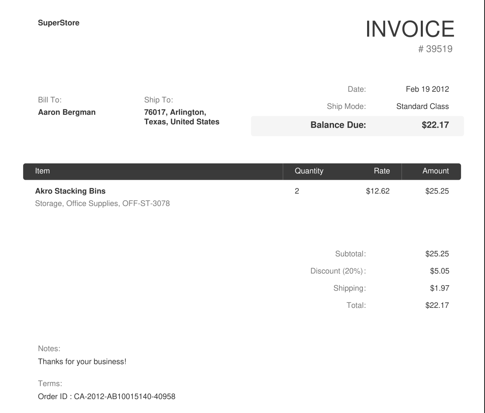
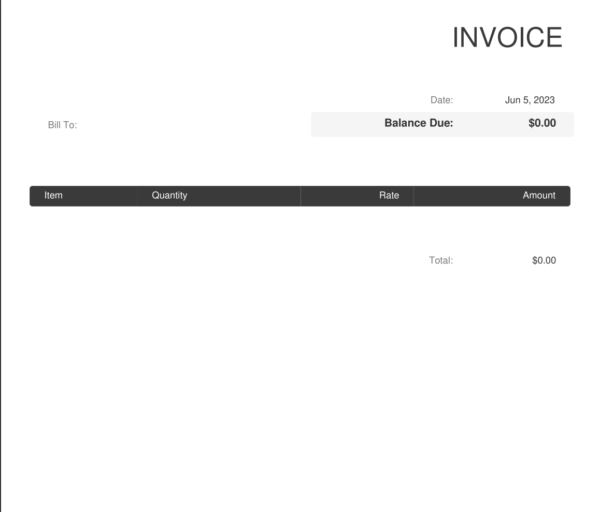
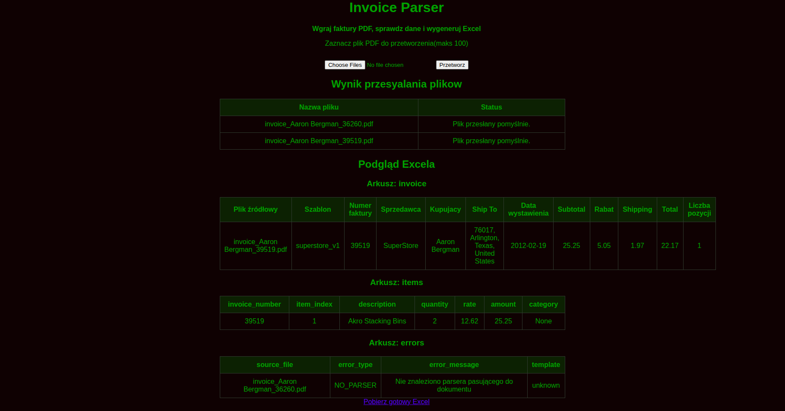
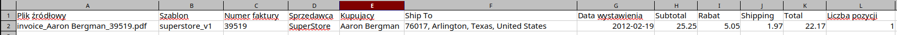
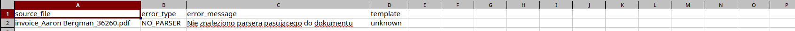

# 📄 Invoice PDF Parser (ETL Pipeline)

A Python project that extracts structured data from PDF invoices and exports it to Excel via a web interface.

The system is designed as a modular ETL pipeline that handles semi-structured data, validates results, and separates successful and failed processing.

---

## 🚀 Features

Web UI for uploading multiple PDF invoices at once
Upload limit: do 100 plików PDF na raz
PDF text extraction and parser selection via main_files.pipeline
Validation of invoice data (status OK / błąd)
Export to Excel with podglądem i pobraniem
Automatic file handling:
uploaded → uploads
valid → archive
invalid → failed
generated Excel → output
Modular parser architecture, łatwe dodawanie kolejnych formatów
---

## ⚙️ How It Works

Uruchamiasz aplikację webową
Otwierasz przeglądarkę na http://127.0.0.1:8000
Wybierasz kilka plików PDF (multiple)
Klikasz Przetwórz
Pliki są zapisywane na serwerze w uploads
Backend odpala parser i generuje wynikowy Excel
UI pokazuje tabelę wyników oraz podgląd arkuszy
Możesz pobrać gotowy plik .xlsx
---

## 📊 Example

### Input invoice (PDF)


### Failed invoice (PDF)


### User Interface


### Parsed invoice data (Excel - invoice sheet)


### Extracted items (Excel - items sheet)


### Error handling (Excel - errors sheet)


---

## 📦 Installation

```bash
# 1. Clone repository
git clone https://github.com/adrians00003-byte/Conv_pdf_ex.git
cd Conv_pdf_ex

# 2. Create virtual environment
python -m venv venv

# Activate environment:
# Linux / Mac:
source venv/bin/activate

# Windows:
venv\Scripts\activate

# 3. Install dependencies
pip install -r requirements.txt
```
---

## ▶️ Usage
```bash
uvicorn web.app:app --reload
```
open http://127.0.0.1:8000

 ## 📂 Input

Input
Przesyłaj pliki PDF przez webowy formularz
Output
uploads → zapisane pliki PDF
output → wygenerowany Excel
archive → poprawnie przetworzone PDF
failed → pliki z błędami
---

## 🧪 Testing
``` bash
pip install -r requirements-dev.txt
pytest
```
---

## 📁 Project Structure

web - web UI, app, templates, upload/output/archive/failed
extract - PDF text extraction
parser - invoice parsers + registry
main_files - pipeline, modele, walidatory
excel - Excel export logic
tests - unit and pipeline tests
docs - screenshots

---

## ⚠️ Current Limitations

Obsługa jednego podstawowego formatu faktury
Nowe układy faktur wymagają dodania parsera
Web UI obsługuje maksymalnie 100 plików na upload
---

## 🧠 What This Project Demonstrates

-Praca z półstrukturalnymi danymi (PDF → Excel)
Projektowanie modularnego pipeline’u ETL
Walidacja i obsługa błędów
Webowy interfejs użytkownika z podglądem wyników
Rozszerzalna architektura parserów
---

## 📌 Future Improvements (optional)

Obsługa wielu układów faktur
Rozszerzony parser pozycji faktury
Lepsze walidacje i raportowanie błędów
Asynchroniczne przetwarzanie większej liczby plików
UI z wyborem arkuszy i filtrowaniem wyników